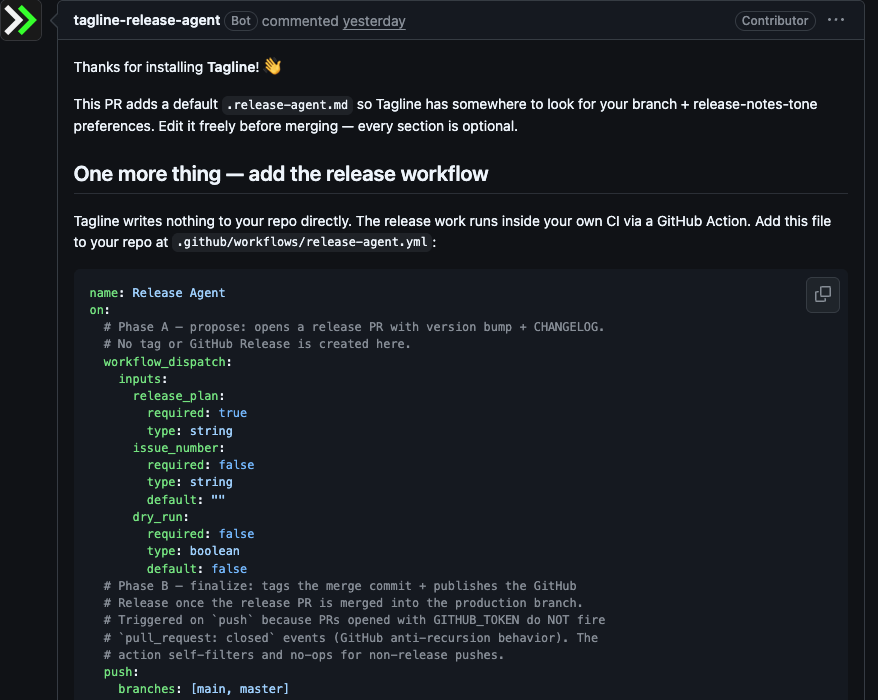
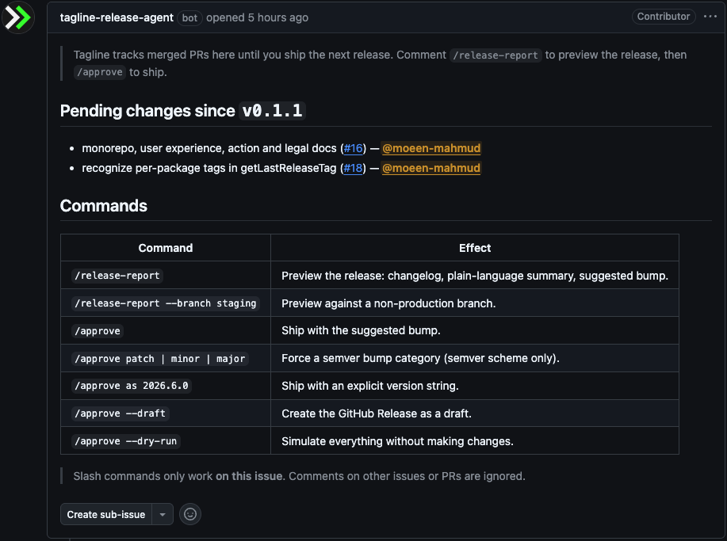
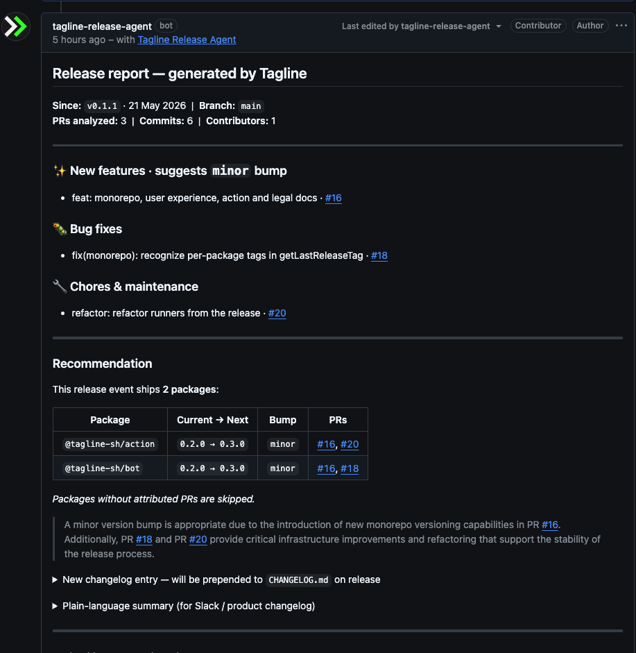
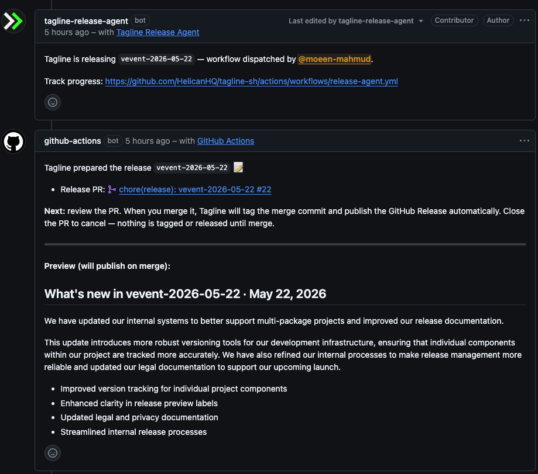

# Tagline: GitHub-native release-management agent

> Close the gap between developer changelogs and user release notes — without leaving GitHub.


> "The CHANGELOG is for the developers and the RELEASE NOTES are for the users." — [Keep a Changelog](https://keepachangelog.com/en/1.0.0/#release-notes-vs-changelog)

Most release tools (semantic-release, Changesets, release-please) automate what happens _after_ you decide to release. They produce a technically-correct changelog that nobody outside your team reads, and you end up writing the customer-facing version manually anyway. Tagline closes both gaps in one pass: it reads merged PRs since your last tag, understands conventional commits, generates **both** a technical changelog **and** a plain-language summary (with an AI-reasoned version bump suggestion), and — once you `/approve` — runs the release end-to-end.

You stay in control. The bot only suggests; the action only runs on your explicit approval.

## See it in action

The four moments below show the full release cycle, from the first install through the published release. All slash commands happen on **one canonical GitHub Issue** per release cycle — no dashboard, no separate UI.

### 1. The bot opens a `Configure Tagline` PR on install

It drops a default `.release-agent.md` config and a workflow file template into a single PR for you to review and merge. One artifact, one decision, no surprises.



### 2. After a PR merges, Tagline opens a release-tracking issue

Labelled `tagline:release-pending`. The body lists every merged PR since the last release, with a quick-reference for the slash commands. This is the **canonical venue** — every `/release-report` and `/approve` for this release cycle happens here.



### 3. Comment `/release-report` and the bot replies with the full plan

Per-package bump suggestions, the AI-reasoned narrative, the technical changelog preview, **and** the plain-language summary you can paste straight into Slack or your customer changelog.



### 4. Comment `/approve` and the release runs end-to-end

The action opens a release PR in your repo (with your `GITHUB_TOKEN`, under your audit log). Review it, merge it, and Tagline tags the merge commit, publishes the GitHub Release, and closes the tracking issue with the "Ready to share" summary.



## How it works

```
A PR merges into your production branch
              ↓
       Bot opens (or updates) a release-tracking issue labeled `tagline:release-pending`
              ↓
Technical Lead comments /release-report ON THAT ISSUE
              ↓
       Bot reads PRs since last tag, parses commits, calls AI
              ↓
       Bot edits the report into the issue thread with the
       suggested bump + reasoning
              ↓
Technical Lead comments /approve minor (still on the release issue)
              ↓
       Bot triggers workflow_dispatch with the release plan in two phases:
              ↓
   ┌──── Phase A — propose ────────────────────────────────────┐
   │  Action bumps version, writes CHANGELOG.md, pushes the     │
   │  release/vX.Y.Z branch, opens a release PR.                │
   │  NO tag, NO GitHub Release yet. Acknowledgement comment    │
   │  goes back to the release-tracking issue.                  │
   └────────────────────────────────────────────────────────────┘
              ↓
Technical Lead reviews the PR, merges it (or closes it to cancel)
              ↓
   ┌──── Phase B — finalize (on push to production) ───────────┐
   │  Action tags the merge commit, publishes the GitHub        │
   │  Release with the plain-language summary above the         │
   │  technical changelog, posts the "Ready to share" block     │
   │  on the release-tracking issue, and closes it.             │
   └────────────────────────────────────────────────────────────┘
```

Nothing is tagged or published until the release PR is merged. The bot **never writes** to your repo. Only the action does, and only inside your own CI with your own `GITHUB_TOKEN`. Your branch protections and audit log stay intact.

> [!IMPORTANT]
> Make sure your workflow gives the action `contents: write` and `pull-requests: write` permissions, and that the repo allows GitHub Actions to create pull requests (Settings → Actions → General → Workflow permissions).

Slash commands work **only** on the bot-managed release-tracking issue (identified by the `tagline:release-pending` label plus a hidden marker in the issue body). Comments anywhere else are ignored silently — no notification spam.

## Five-minute install

1. Install the [Tagline GitHub App](https://github.com/apps/tagline-sh) on a repo. (Or [self-host](./docs/self-hosting.md).)
2. The Bot will automatically create a pull request if the repo doesn't have `.release-agent.md` config file and suggest a workflow template. Merge it to get a config file in place. Or you can copy [`examples/single-repo/.github/workflows/release-agent.yml`](./examples/single-repo/.github/workflows/release-agent.yml) into your repo. (Monorepo? Use [`examples/monorepo/...`](./examples/monorepo/.github/workflows/release-agent.yml).)
3. **Only if you self-host:** add an `AI_API_KEY` repo secret. Any OpenAI-compatible provider works — OpenAI, OpenRouter, Groq, Ollama, Anthropic via proxy. On the hosted instance the key is managed for you.
4. Merge a PR. Tagline opens a `🚀 Release pending` issue.
5. Comment `/release-report` on that issue, then `/approve` to ship.

Full walkthrough: [Getting started](./docs/getting-started.md).

## Slash commands

```
/release-report
/release-report --branch staging

/approve
/approve patch | minor | major
/approve --draft
/approve --dry-run
/approve minor --draft
```

See [slash-commands.md](./docs/slash-commands.md) for behavior, error cases, and the comment lifecycle.

## Highlights

- **GitHub-native UX.** One canonical release-tracking issue per release cycle, opened automatically when PRs land. No dashboard, no separate login, no comments-on-random-issues confusion.
- **AI is an enhancement, never a dependency.** Calls fail open: reports still generate deterministically from commits, with the reasoning replaced by `"AI unavailable — manual review required"`.
- **Stateless by design.** GitHub is the state store. Git tags = last release. `.release-agent.md` = config. No database to operate.
- **Monorepo-aware.** Auto-detects pnpm-workspaces, Turborepo, Nx, Lerna, npm/yarn workspaces. Each affected package versioned independently.
- **BYOK.** OpenAI-compatible API. Override `AI_BASE_URL` and `AI_MODEL` for any provider; default is OpenRouter + `Google Gemini-3.1 Flash Lite` for cost.
- **MIT licensed, self-host first-class.** The Action and the bot are both MIT. A hosted GitHub App is available, but every install can pivot to self-hosting on its own infrastructure without code changes — see [self-hosting](./docs/self-hosting.md).

## Architecture

Two-component split — the bot thinks, the action writes.

| Package           | What it is                                                                                                                                                                                                                                                                     |
| ----------------- | ------------------------------------------------------------------------------------------------------------------------------------------------------------------------------------------------------------------------------------------------------------------------------ |
| `apps/bot`        | Probot GitHub App. Stateless. Reads from GitHub on demand. Posts comments. Never writes to user repos.                                                                                                                                                                         |
| `apps/action`     | Node 20 GitHub Action. Runs in two phases: `workflow_dispatch` (propose — bump + CHANGELOG + branch + PR, no tag) and `push` to the production branch (finalize — tag the merge commit + publish GitHub Release + close the release-tracking issue when the release PR lands). |
| `packages/shared` | TypeScript types + zod schemas. The `ReleasePlan` contract between bot and action.                                                                                                                                                                                             |

The action runs **in the user's CI**, with the user's secrets and audit log. The bot only proposes; the action only acts on explicit `/approve`.

## Local development

```bash
pnpm install
pnpm typecheck
pnpm lint
pnpm test
pnpm build
```

Bot dev requires a personal GitHub App + smee.io webhook proxy — see [`apps/bot/README.md`](./apps/bot/README.md).

## Documentation

- [Getting started](./docs/getting-started.md)
- [Slash commands](./docs/slash-commands.md)
- [Configuration (`.release-agent.md`)](./docs/configuration.md)
- [Monorepo behavior](./docs/monorepo.md)
- [Self-hosting](./docs/self-hosting.md)
- [Security & supply-chain guidance](./docs/security.md)

## Roadmap

This repo ships the MVP. Post-validation roadmap:

- JIRA / Linear API enrichment of ticket refs
- Slack / Teams / Discord release notifications
- Web dashboard for release history + per-repo settings
- GitLab / Bitbucket support
- Independent versioning per monorepo package
- Rollback monitoring + post-release health checks

## A note on the hosted instance

The hosted GitHub App is a convenience, not a commitment. It's operated on best-effort basis by the maintainer and may evolve, pause, or sunset based on maintenance load and operational reality. **The self-hosted path is the durable one** — the Action runs entirely inside your CI with your secrets, and the bot is a stateless Node server you can stand up on Railway, Fly, Render, or any Docker host in under fifteen minutes. If the hosted instance ever retires, every Tagline install can switch to self-hosted with a webhook URL change and zero data migration.

> [!NOTE]
> There's no database, stateless, plain and simple

This shapes the product: features that would only work on a hosted plane (cross-repo analytics dashboards, account-level billing, multi-tenant queues) are deliberately out of scope. Everything Tagline does, it does inside the boundary of a single GitHub repo, so self-hosting one bot per team or per organisation is genuinely sufficient.

See the [Privacy Policy](./docs/legal/privacy.md), [Terms of Service](./docs/legal/terms.md), and [Support policy](./docs/legal/support.md) for the operational specifics of the hosted instance.

## License

MIT — see [LICENSE](./LICENSE). Self-hosting is a feature, not a threat.

### Try the GREAT alternatives

- [Semantic Release](https://github.com/semantic-release/semantic-release)
- [Changesets](https://github.com/changesets/changesets)
- [Release Please](https://github.com/googleapis/release-please)
- [Release Drafter](https://github.com/release-drafter/release-drafter)
- [CHANGELOG.MD](https://changelog.md/)
- [Release Notes IO](https://www.releasenotes.io/)
